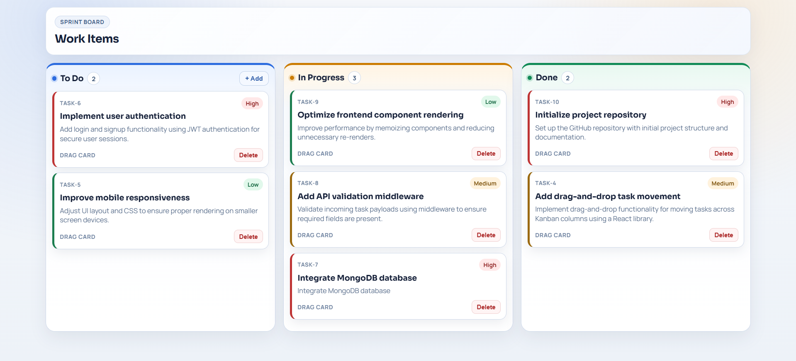

# Full Stack Kanban Task Manager

[](https://github.com/viditpawar/fullstack-kanban-task-manager/actions/workflows/ci.yml)

A full-stack task management application built with React and Express, featuring a Kanban-style board and automated CI checks with GitHub Actions.

## Features

- Create tasks from the UI
- View tasks in Kanban columns
- Update task status across workflow stages
- Delete tasks from the board
- Manage tasks through a REST API
- Run automated linting and backend tests in CI

## Dashboard Preview



## Tech Stack

### Frontend
- React
- Vite
- CSS

### Backend
- Node.js
- Express

### Testing
- Jest
- Supertest

### DevOps / CI
- GitHub Actions

## Project Structure

```text
fullstack-kanban-task-manager/
|-- .github/workflows/      # GitHub Actions workflows
|-- client/                 # React frontend
|-- server/                 # Express backend
|-- architecture.md         # Architecture notes
`-- README.md
```

## Local Development Setup

### Prerequisites

- Node.js 20+ (recommended)
- npm 9+

### 1) Clone the repository

```bash
git clone https://github.com/viditpawar/fullstack-kanban-task-manager.git
cd fullstack-kanban-task-manager
```

### 2) Install dependencies

```bash
npm install
npm install --prefix client
npm install --prefix server
```

### 3) Run the backend

```bash
npm run server
```

Backend runs on `http://localhost:5000`.

### 4) Run the frontend

In a second terminal:

```bash
npm run client
```

Frontend runs on `http://localhost:5173`.

## Available Scripts (Root)

- `npm run client`: Start the Vite frontend dev server
- `npm run server`: Start the backend with nodemon
- `npm run lint`: Run frontend and backend lint checks
- `npm run test`: Run backend tests

## API Endpoints

| Method | Endpoint | Description |
|---|---|---|
| `GET` | `/api/tasks` | Get all tasks |
| `POST` | `/api/tasks` | Create a new task |
| `PUT` | `/api/tasks/:id` | Update a task |
| `DELETE` | `/api/tasks/:id` | Delete a task |

## CI Pipeline

The GitHub Actions workflow (`.github/workflows/ci.yml`) runs on:

- Pushes to `main`
- Pull requests to `main`

It performs:

- Dependency installation (root, client, server)
- Lint checks
- Backend test execution

## Future Improvements

- Add persistent database storage
- Add drag-and-drop task movement
- Add edit-task functionality
- Add authentication and user accounts
- Deploy frontend and backend to cloud platforms

## License

This project is licensed under the MIT License.
